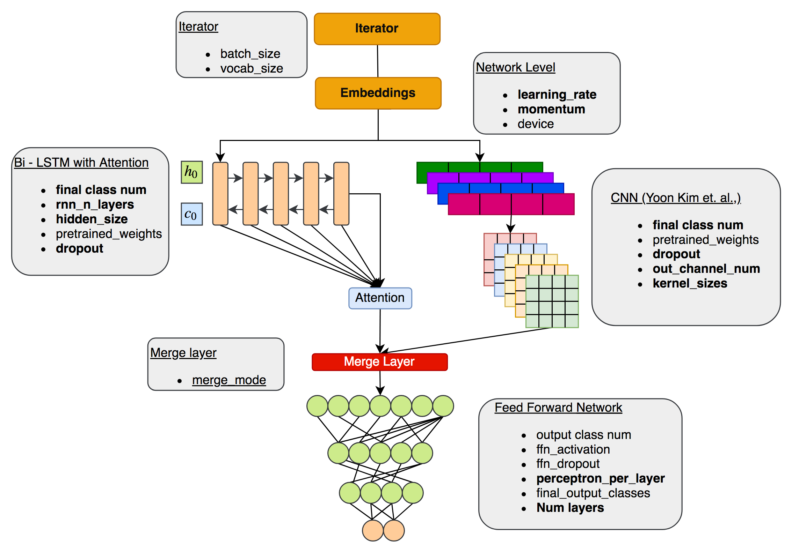

<h1 align="center">Extensible Classification Framework</h1>
---

Extensible Classification framework is an engineering effort to make a well-defined ensemble engine for the text classification task. Extensible Classification framework built with an AutoML approach, it allows easy experimentation with a various model with just 3 steps. with Extensible Classification framework, you can test 100s of model overnight and send the best one to deployment.  This post is a usage guide for the first release of Extensible framework.

This documentation will cover the following points:
- Features of the implementation
- Network Architecture
- Installation and example dataset download
- Usage directions
    - Processing data
    - Getting custom vectors from Fasttext model
    - Defining model config
    - Running experiments
- Modifying  Components
    - For intermediate users
    - For advanced users

# Salient features
1. TorchText based flexible preprocessing
2. Inbuilt custom biomedical tokenizer
3. Inbuilt custom vectorization for biomedical term
4. Accepts pre-trained fasttext, Glove, and Word2Vec vectors
5. Splinning a run that performs N experiments and gives out the best model
6. Random best configuration search and report generation
7. Custom saving and a loading module
8. Only 3 steps to run all experiments
9. End to end customization for intermediate and advanced users

# Network Architecture


*Figure : Showing essential components involved in Extensible Classification framework. It has the following components. (All the parameters shown in **bold** can have multiple values, the various network will be constructed at run time by using these options.)*

Iterator :

    A Torchtext Iterator can take variable batch size and vocab size
Embeddings :

- Pretrained fasttext, Glove and Word2Vec vectors
- Accepts Fasttext model for generating custom embeddings at run time

Bi- LSTM with Attention mechanism:

    Standard Implementation of  LSTM with Attention mechanism in forward and backward direction.
    It has the following configurable parameters
    - final class num
    - rnn_n_layers
    - hidden_size
    - pretrained_weights
    - dropout

Convolution Neural Network ([Convolutional Neural Networks for Sentence Classification](https://arxiv.org/abs/1408.5882) Yoon Kim et. al., Implementation) :
    It has following configurable parameters
    - final class num
    - pretrained_weights
    - dropout
    - out_channel_num
    - kernel_sizes

Merge Layer
    It combines output from the LSTM and CNN layer and provides it to FFN. The Merge mode can be:
    - Concatenate
    - Subtract
    - Add
    - Matmul

Feed Forward Layer :
    It has following configurable paramters
    - output class num
    - ffn_activation
    - ffn_dropout
    - perceptron_per_layer
    - final_output_classes
    - Num layers


# Installation
Installation Including following steps
- Clonning repository
- Installation through pip

``` bash
1. clone https://gitlab.innoplexus.de/Innoplexus-Consulting-Services/extensible_classification_framework.git
2. pip install -U extensible_classification_framework/dist/extensible_classification_framework-0.3-py3-none-any.whl
```

# Usage Directions
`extensible_classification_framework` can be run by folowing 3 steps:
 1. Preprocess
 2. Prepare Vectors
 3. Run training and paramter selection

#### 1. Preprocess
The input file must be having two column seperated by tab, comma, semicolo or colon. The first colmn should be a class in interger the second column should be text one at each line.
```bash
python preprocess.py --input_file example/data/crude/small_data.tsv --output_destination example/data/processed/ --sep "tab"
```

#### 2. Prepare Vectors
> Note : This is an optional step. Use this step if you want to build vector by calling fasttext model. Otherwise in the step 3 you may provide pre-trained word2vec, glove or fasttext embeddigns.

This step is to call a fast text module prepared usiing gensim for vectorization on custom tokens. For this you need to have a pre-trained fasttext model.
```bash
python prepare_vectors.py --model_path example/fasttext_model/fastText.model --train_file example/data/processed/20190401-171735_train.json --test_file example/data/processed/20190401-171735_test.json --vector_output_file example/vectors/vectors.vec
```

#### 3. Run training and parameter selection
Before running the below given step, setup parameters in the `config.py`. A sample config.py looks like as given below:

```python
class parameters:
    def __init__(self):
        """
        Here you may set parameters to be set
        """
        self.cnn_rnn_vocab_size = 0 #len(sentiment_vocab)
        self.cnn_rnn_embed_dim = 100
        self.cnn_rnn_class_num = [200] # configurable
        self.cnn_out_channel_num = [24] # configurable
        self.cnn_kernel_sizes =  [3,4,5] # configurable
        self.rnn_n_layers = [1,2,3] # configurable
        self.rnn_hidden_size =  [128] # configurable
        self.use_pretrained_weights = True
        self.cnn_rnn_weights =  "" # sentiment_vocab.vectors
        self.cnn_rnn_weight_is_trainable =   False
        self.dropout = [0.2] # configurable
        self.batch_size = 32 #batch_size
        self.merge_mode = "CONCAT"
        self.ffn_activation =  "Relu"
        self.ffn_final_output_classes =  2
        self.ffn_perceptron_per_layer = [[100,50, 25]] # configurable
        self.ffn_layer_wise_dropout = 0.2
        self.learning_rate =  [0.2] # configurable
        self.momentum = [0.9] # configurable
        self.device = "" # device
        .
        .
        .
```
---
All the configurable parameter are well indicated, you can provide many configurations for these parameters and all combination will be explored at run time.

```bash
python main.py --train_json example/data/processed/20190401-171735_train.json --test_json example/data/processed/20190401-171735_test.json --embeddings example/vectors/vectors.vec --experiment_output_folder experments --epochs 1 --num_random_search 1 --max_token 1000 --device "gpu"
```

# Modifying  Components

## 1. For Intermediate users

Some changes that you might want to do is as given below. **(These changes do not require recompilation and reinstallation)**

1. Changing performance matrix
2. Changing learning rate decay

### 1.1. Changing performance metrics
The existing performance matrix is implemented in `main.py` as :

```python
def binary_accuracy(preds, y):
    """
    Returns accuracy per batch, i.e. if you get 8/10 right, this returns 0.8, NOT 8
    """
    rounded_preds = torch.argmax(preds, dim=1)
    correct = (rounded_preds == torch.argmax(y, dim=1)).float() #convert into float for division
    acc = correct.sum()/len(correct)
    return acc
```
This function is being called by `test_accuracy_calculator` and `train` function for to calculate accuracy.
You may change this function to calculate F1, Recall and Precision, and run your experiments.


### 1.2. Changing learning rate decay

Learning rate decay is implemented as:
```python
if (i != 0 and i%10 == 0 ):
    for param_group in optimizer.param_groups:
        param_group['lr'] = param_group['lr']/2
    print(" === New Learning rate : ", param_group['lr'], " === ")
```
By default learning rate is halved every 10 epochs. You may change this as well


---

## 2. For Advanced Users
**These chnages require recompilation and reinstallation**

### 2.1 Changing  something in the core layers


Any changes made in the package (inside path `extensible_classification_framework/extensible_classification_framework/`) requires recompiling and re-installation.
For example, I want to change the ontology file which helps in the custom tokenization metrics. The change the existing ontology file following example needs to be done.
1. Replace 'resources/ontology_for_tokenizer.list' with new ontology
2. cd to root project folder `/extensible_classification_framework`
3. Recompile with `python setup.py sdist bdist_wheel`
4. New source will be generated at folder dist/ as `dist/extensible_classification_framework-0.0.1-py3-none-any.whl`
5. Install the new source with pip `pip install -U dist/extensible_classification_framework-0.0.1-py3-none-any.whl`

# Output
At the end of the experiement, the output of the model performance will be written to the output folder. A report along with model weights and detailed parameters for each model will be saved.

```bash
Model Name : 20190307-214950	{'Train_accuracy': 0.50105, 'Test accuracy': 0.49880573248407645, 'Epoch Loss': 0.2500021963596344}
Model Name : 20190307-225016	{'Train_accuracy': 0.9911, 'Test accuracy': 0.9140127388535032, 'Epoch Loss': 0.008758203177069063}
Model Name : 20190307-235531	{'Train_accuracy': 0.97995, 'Test accuracy': 0.8957006369426752, 'Epoch Loss': 0.019956206692382284}
Model Name : 20190308-005548	{'Train_accuracy': 0.50095, 'Test accuracy': 0.49880573248407645, 'Epoch Loss': 0.25000217723846435}
Model Name : 20190308-020039	{'Train_accuracy': 0.9871, 'Test accuracy': 0.9112261146496815, 'Epoch Loss': 0.01284036571398924}
Model Name : 20190308-031252	{'Train_accuracy': 0.98305, 'Test accuracy': 0.902468152866242, 'Epoch Loss': 0.01696283000286867}
Model Name : 20190308-043051	{'Train_accuracy': 0.98465, 'Test accuracy': 0.9060509554140127, 'Epoch Loss': 0.015278951324956097}
Model Name : 20190308-054936	{'Train_accuracy': 0.9839, 'Test accuracy': 0.9064490445859873, 'Epoch Loss': 0.016067581347950426}
Model Name : 20190308-070506	{'Train_accuracy': 0.9858, 'Test accuracy': 0.9058519108280255, 'Epoch Loss': 0.014284096479360318}
```
